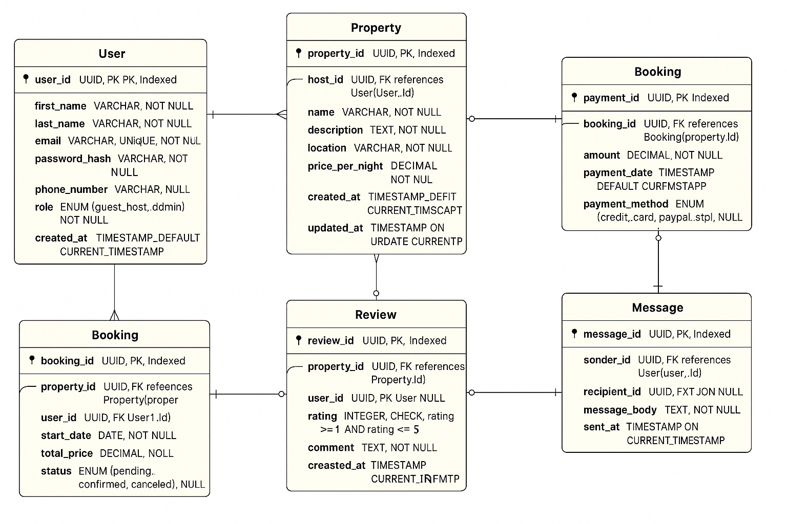

# Database Structure Overview

## Intro

This doc breaks down the database design for a rental platform — kind of like an Airbnb-style app. It covers users, properties, bookings, payments, reviews, and messaging. Everything is structured to follow **Third Normal Form (3NF)** to keep things clean, avoid redundancy, and make managing data simple and reliable.

---

## Entities at a Glance

### 1. **User**

Represents all platform users — whether they're guests, hosts, or admins.

- **Primary Key:** `user_id` (UUID)
- **Fields:**
  - `first_name`, `last_name`: User's name
  - `email`: Used as a unique login
  - `password_hash`: Encrypted password
  - `phone_number`: Optional contact info
  - `role`: Can be `guest`, `host`, or `admin`
  - `created_at`: When the user was created

---

### 2. **Property**

Each listing posted by a host shows up here.

- **Primary Key:** `property_id` (UUID)
- **Foreign Key:** `host_id` → `User(user_id)`
- **Fields:**
  - `name`, `description`, `location`: Info about the property
  - `pricepernight`: Nightly rate
  - `created_at`, `updated_at`: Timestamps for audit tracking

---

### 3. **Booking**

Holds reservation data when a guest books a place.

- **Primary Key:** `booking_id` (UUID)
- **Foreign Keys:**
  - `property_id` → `Property(property_id)`
  - `user_id` → `User(user_id)`
- **Fields:**
  - `start_date`, `end_date`: Booking duration
  - `total_price`: Cost for the whole stay
  - `status`: One of `pending`, `confirmed`, or `canceled`
  - `created_at`: When the booking was made

---

### 4. **Payment**

Captures payment transactions tied to bookings.

- **Primary Key:** `payment_id` (UUID)
- **Foreign Key:** `booking_id` → `Booking(booking_id)`
- **Fields:**
  - `amount`: Total amount paid
  - `payment_method`: Could be `credit_card`, `paypal`, or `stripe`
  - `payment_date`: Timestamp of when payment was made

---

### 5. **Review**

Guests leave reviews here after staying at a property.

- **Primary Key:** `review_id` (UUID)
- **Foreign Keys:**
  - `property_id` → `Property(property_id)`
  - `user_id` → `User(user_id)`
- **Fields:**
  - `rating`: Score from 1 to 5
  - `comment`: Guest's feedback
  - `created_at`: When the review was posted

---

### 6. **Message**

Used for chat between users (like host ↔ guest).

- **Primary Key:** `message_id` (UUID)
- **Foreign Keys:**
  - `sender_id` → `User(user_id)`
  - `recipient_id` → `User(user_id)`
- **Fields:**
  - `message_body`: The message text
  - `sent_at`: When the message was sent

---

## Indexing & Constraints

- **Primary keys** are indexed by default.
- **Extra Indexes:**

  - `email` in `User` (for quick logins)
  - `property_id` in `Property` and `Booking`
  - `booking_id` in both `Booking` and `Payment`

- **Constraints:**
  - `email` is unique in `User`
  - `rating` in `Review` must be between 1 and 5
  - Foreign keys maintain relationship integrity

---

## Normalization Status

This schema is fully normalized to **3NF**:

- ✅ 1NF: No multi-valued or repeating fields
- ✅ 2NF: No partial dependencies
- ✅ 3NF: No transitive dependencies

Benefits:

- Reduces data duplication
- Keeps updates and deletes clean
- Makes the structure easy to maintain and scale

---

## Final Thoughts

This database layout covers all key parts of the rental platform — user accounts, listings, reservations, transactions, chats, and reviews. Thanks to proper normalization and clear relationships, the design is solid, future-proof, and ready for real-world use.

